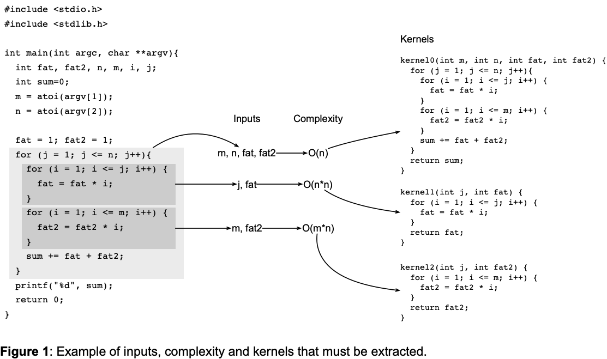

# Hamsa
Kernels are nests of loops that process multidimensional arrays. **Hamsa** is a tool to extract kernels from programs and infer their asymptotic complexity. Figure 1 illustrates this:

   

For linear loop bounds, inferring the complexity is trivial. However, for non-linear bounds this task is more challenging. We intend to use the approach proposed by [Gulwani et al.](https://www.microsoft.com/en-us/research/wp-content/uploads/2016/12/sas11-bound.pdf) to implement it.

## Building the tool

First of all, you need to inform the directory where LLVM is built. You can do this by changing the value of `LLVM_BUILD_DIR` at `tool/setup.sh`. 

After configuring the build dir, you can setup the tool by running this command:

    ./setup.sh

## Running

After you've built the tool, you can run it as a Clang plugin:

    clang++ -cc1 -load ./build/src/libLoopInfoTool.so -plugin hamsa inputFile.cpp
